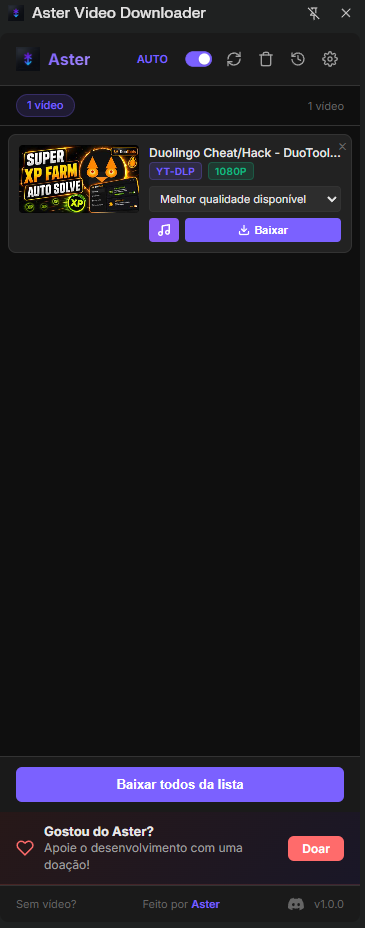
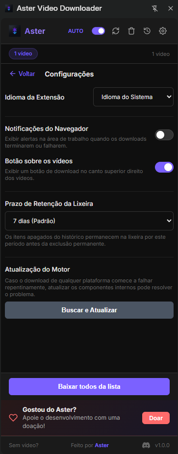

# Aster Video Downloader

  
  

O Aster é uma extensão híbrida (Extensão Chrome + Companion App nativo) projetada para baixar vídeos de diversas plataformas sociais e páginas da web, com suporte avançado a HLS, conversão automática e suporte a formatos de alta resolução.

## 🚀 Como funciona a Arquitetura?

O projeto utiliza duas peças essenciais que se comunicam via **Native Messaging**:

1. **A Extensão do Chrome:** Injeta scripts nas páginas para detectar vídeos (HTML5, Twitter, Instagram, TikTok, etc) e intercepta requisições de rede (streams HLS/m3u8). O painel lateral (Side Panel) é a interface principal do usuário.
2. **O Companion App:** Um executável local leve que utiliza `yt-dlp` e `ffmpeg` sob o capô para baixar e converter vídeos complexos (HLS, YouTube com áudio/vídeo separados, etc). O Companion App roda temporariamente um servidor HTTP local para servir o arquivo pronto à extensão, que por sua vez aciona a janela nativa de "Salvar Como" do Chrome.

## ⚙️ Instalação

Como a extensão requer comunicação com processos locais do seu computador, a instalação do Companion App é obrigatória.

1. Baixe e instale a extensão carregando-a "Unpacked" (modo desenvolvedor) no Chrome (página `chrome://extensions/`).
2. Instale o Companion App correspondente ao seu sistema:

### Windows (Recomendado)
Baixe o instalador `AsterCompanionSetup.exe` na aba de Releases, dê duplo clique e siga o assistente. Na primeira execução, o Aster baixa automaticamente os componentes necessários (yt-dlp e FFmpeg).
**Nota:** O instalador não é assinado digitalmente, então o SmartScreen do Windows pode exibir um aviso. Basta clicar em "Mais informações" e depois em "Executar assim mesmo".

### macOS / Linux
Acesse a pasta `companion-app/` e execute o script `install.sh`. Ele registrará o host no sistema.

### Instalação Manual (Avançada - Windows)
Para usuários de Windows que preferem não usar o instalador Inno Setup:
Acesse a pasta `companion-app/` e execute o script `install.bat`. Ele registrará o host no sistema para que o Chrome consiga iniciá-lo.

## 🌐 Sites Suportados

Graças aos Extratores Híbridos e ao motor `yt-dlp`, o Aster suporta:
- YouTube (inclusive formatos acima de 1080p, áudio, Shorts)
- Twitter / X
- Instagram (Reels e Posts)
- TikTok
- Facebook
- Reddit
- Qualquer vídeo HTML5 genérico (`<video src="...">`)
- Streams HLS (`.m3u8`), interceptando e contornando autenticação utilizando seus próprios cookies.

## 🔒 Permissões da Extensão

- `activeTab` e `scripting`: Para injetar scripts e encontrar vídeos no DOM das páginas.
- `webRequest`: Para interceptar os arquivos `.m3u8` em background para captura de streams HLS.
- `downloads`: Para exibir o diálogo de "Salvar Como" nativo com o vídeo pronto.
- `nativeMessaging`: Para se comunicar com o Companion App.
- `storage`: Para salvar o histórico de downloads e configurações.
- `cookies`: Apenas repassados para requisições do Companion App durante o download (HLS/YouTube) para garantir que vídeos privados/pagos aos quais você tem acesso sejam baixados corretamente.

## 🚧 Limitações Conhecidas

- **Plataformas:** Windows conta com instalador automatizado standalone (`AsterCompanionSetup.exe`) e via `install.bat`. macOS/Linux têm suporte via `install.sh`. Node.js não é mais necessário graças ao empacotamento com `pkg`.
- **Resoluções HLS Múltiplas:** Ao detectar um M3U8 variante único, não listamos múltiplas qualidades ainda.
