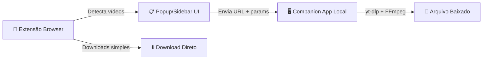

# Plano: Extensão de Download de Vídeos — "VidGrab"

## Visão Geral

Criar uma extensão de download de vídeos **sem restrições premium**, compatível com Chrome (MV3) e Firefox, que suporta YouTube, Twitter/X, Instagram, Facebook, Reddit, Kiwify e sites genéricos.

---

## Arquitetura Proposta

A solução mais robusta e confiável usa uma **arquitetura híbrida**:



### Por que arquitetura híbrida?

| Abordagem                             | Prós                             | Contras                                                                                                                     |
| ------------------------------------- | -------------------------------- | --------------------------------------------------------------------------------------------------------------------------- |
| **100% no browser**                   | Sem instalação extra             | YouTube quebra toda semana; FFmpeg.wasm é 50x mais lento; sem suporte a alguns codecs; **estoura memória em vídeos longos** |
| **100% app desktop**                  | Poderoso                         | Sem integração com browser, UX ruim                                                                                         |
| **Híbrida (extensão + companion)** ✅ | Melhor UX + confiabilidade total | Requer instalação da companion app                                                                                          |

> [!IMPORTANT]
> A extensão funcionará para **downloads simples** (vídeos HTML5 diretos, HLS curto sem DRM) **sem a companion app**. A companion app será necessária para YouTube, muxing de áudio+vídeo, conversão MP3, e — importante — **qualquer HLS longo** (ver seção "Como o Download Funciona").

> [!NOTE]
> Essa divisão de responsabilidades não é um palpite: é literalmente como o Video DownloadHelper (referência original) resolve o mesmo problema. A documentação deles confirma que a Companion App existe justamente porque a extensão sozinha não tem acesso ao sistema de arquivos nem consegue escrever em disco progressivamente — por isso streams HLS fragmentados sempre passam pela app nativa, que "costura" os segmentos e grava direto no disco, sem acumular tudo em memória no browser.

---

## Como o Download Funciona (por tipo de vídeo)

| Cenário                                              | Caminho técnico                                                                                                                                              | Observação                                           |
| ---------------------------------------------------- | ------------------------------------------------------------------------------------------------------------------------------------------------------------ | ---------------------------------------------------- |
| **Vídeo MP4/WebM direto**                            | Browser puro — `chrome.downloads.download({url, filename})`                                                                                                  | Simples, confiável, sem companion app                |
| **HLS curto** (clipe de Twitter/Reddit, poucos MB)   | Baixa segmentos `.ts` via `fetch()` no **offscreen document**, concatena em `Blob`, gera `blob:` URL e passa pro `chrome.downloads.download()`               | Aceitável para arquivos pequenos                     |
| **HLS longo** (aula de curso, live, vídeo de +10min) | **Sempre via companion app** — Node.js baixa segmento por segmento e escreve direto no disco com `fs.createWriteStream`, sem acumular nada em RAM do browser | Elimina o risco de estourar memória                  |
| **YouTube**                                          | Companion app chama `yt-dlp`, que resolve formatos/assinaturas e já baixa direto pro disco                                                                   | Mais robusto que qualquer extração manual no browser |
| **Muxing áudio+vídeo / conversão MP3**               | Companion app chama `ffmpeg` local                                                                                                                           | Fora da sandbox do browser, sem limitação de tamanho |
| **Redes sociais (Instagram/Facebook/Reddit)**        | Extensão intercepta resposta de rede (GraphQL/JSON) pra achar a URL real, depois trata como MP4 direto ou HLS conforme o caso                                | Reaproveita os caminhos acima                        |

**Por que HLS longo não pode ficar só no browser:** o service worker do Manifest V3 não tem acesso a filesystem, e manter um vídeo de 1-2h inteiro como `Blob` em memória antes de salvar pode facilmente passar de 1-2GB de RAM — trava em máquinas mais fracas. Escrever em stream direto pro disco (o que só a companion app consegue) resolve isso de raiz.

---

## Componentes do Projeto

### 1. Extensão Browser (Cross-browser: Chrome MV3 + Firefox)

```
vidgrab-extension/
├── manifest.json              # MV3 para Chrome, MV2 shim para Firefox
├── background/
│   └── service-worker.js      # Intercepta requests, coordena downloads, gerencia reconexão com companion app
├── content-scripts/
│   ├── detector.js            # Genérico: detecta <video>, <source>, HLS
│   ├── youtube.js             # Injeção específica para YouTube
│   ├── twitter.js             # Twitter/X
│   ├── instagram.js           # Instagram
│   ├── facebook.js            # Facebook
│   ├── reddit.js              # Reddit
│   └── course-platforms.js    # Kiwify e outras plataformas de curso (Hotmart, Udemy, etc.)
├── popup/
│   ├── popup.html             # Interface principal
│   ├── popup.css
│   └── popup.js
├── sidebar/
│   ├── sidebar.html           # Painel lateral (Chrome sidePanel)
│   └── sidebar.js
├── lib/
│   ├── hls-parser.js          # Parse de playlists M3U8
│   ├── mpd-parser.js          # Parse de DASH manifests
│   ├── native-messaging.js    # Comunicação com companion app (com lógica de reconexão)
│   └── download-manager.js    # Gerencia fila de downloads e decide o caminho (direto/offscreen/companion)
├── offscreen/
│   ├── offscreen.html         # Offscreen document para processamento de HLS curto
│   └── offscreen.js
└── _locales/
    ├── en/messages.json
    └── pt_BR/messages.json
```

### 2. Companion App (Node.js empacotado com pkg/nexe)

```
vidgrab-companion/
├── src/
│   ├── main.js                # Servidor de Native Messaging
│   ├── downloader.js          # Wrapper para yt-dlp
│   ├── stream-writer.js       # Download de HLS longo direto pro disco (fs.createWriteStream)
│   ├── converter.js           # Wrapper para FFmpeg
│   └── playlist.js            # Lógica de playlists
├── bin/
│   ├── yt-dlp.exe             # Binário embutido
│   └── ffmpeg.exe             # Binário embutido
├── install.bat                # Registra Native Messaging Host
└── install.sh                 # Linux/Mac
```

---

## Riscos Técnicos a Considerar

> [!WARNING]
> Pontos que o plano original não cobria e que valem atenção antes de codar.

1. **Ciclo de vida do service worker (MV3)**: ele é "não-persistente" e pode ser encerrado pelo Chrome após ~30s de inatividade. Se estiver segurando uma conexão de Native Messaging com a companion app, ela morre junto — `native-messaging.js` precisa de lógica de reconexão robusta (não é só um detalhe, deveria ser tratado como parte central da Fase 4).
2. **Manutenção constante dos extractors de rede social**: Instagram, Facebook e Twitter mudam suas respostas internas com frequência. Não é problema de arquitetura, mas essas partes vão quebrar e vão precisar de patches recorrentes.
3. **Distribuição na Chrome Web Store**: extensões de download de vídeo têm histórico de serem removidas por violarem termos de uso das plataformas-alvo, mesmo com código legítimo. Vale ter como plano B a instalação manual (modo desenvolvedor / pacote `.crx`/`.xpi` direto), caso a loja rejeite ou remova depois.
4. **Kiwify e DRM**: conteúdo protegido com Widevine não será baixável — isso já está corretamente assumido no plano. Vale deixar claro que baixar cursos pagos pode esbarrar nos termos de uso da plataforma, independente da parte técnica.

---

## Estratégia por Site

### YouTube

- **Método**: Companion app com `yt-dlp` (mais confiável)
- **Fallback**: Extração via `youtubei.js` (biblioteca JS, mesma que o DownloadHelper usa)
- **Features**: Qualidades 144p–4K, playlists, MP3
- **Detecção**: Content script detecta página de vídeo, extrai video ID da URL

### Twitter/X

- **Método**: Interceptação de requests para `video.twimg.com`
- **Detecção**: Content script monitora tweets com vídeo
- **Qualidades**: Extrai todas as variantes do M3U8

### Instagram

- **Método**: Interceptar GraphQL responses que contêm URLs de vídeo
- **Detecção**: Content script em posts/reels/stories
- **Nota**: Requer que o usuário esteja logado

### Facebook

- **Método**: Interceptar responses com `video_url` ou parsear `og:video` meta tags
- **Detecção**: Content script detecta player do Facebook

### Reddit

- **Método**: API pública do Reddit (`https://www.reddit.com/r/.../comments/.../.json`)
- **Detecção**: Content script em posts com vídeo
- **Nota**: Reddit hospeda separado áudio e vídeo — precisa muxing

### Kiwify / Plataformas de Curso (`course-platforms.js`)

- **Método**: Interceptar playlists HLS (`.m3u8`) via `webRequest` listener
- **Detecção**: Monitor de network para URLs de stream
- **Download**: Sempre via companion app (aulas costumam ser longas — ver seção "Como o Download Funciona")
- **Limitações**: Conteúdo com DRM (Widevine) não será possível baixar

### Sites Genéricos

- **Método 1**: Detectar elementos `<video>` e `<source>` no DOM
- **Método 2**: Interceptar requests de rede para `.m3u8`, `.mpd`, `.mp4`, `.webm`
- **Método 3**: Monitor de `MediaSource` API

---

## Funcionalidades Detalhadas

### Detecção Automática de Vídeos

```
1. Content script injeta em todas as páginas
2. Monitora: <video>, <source>, blob URLs, network requests
3. Envia lista de vídeos encontrados ao service worker
4. Badge no ícone mostra quantidade de vídeos detectados
5. Popup lista vídeos com thumbnail, título e opções
```

### Seleção de Qualidade

```
- Para HLS: parseia M3U8 master playlist → lista variantes (720p, 1080p...)
- Para YouTube: yt-dlp retorna formatos disponíveis
- Para redes sociais: extrai todas as URLs de qualidade disponíveis
- UI: Dropdown com qualidades + tamanho estimado do arquivo
```

### Conversão MP3

```
- Via companion app: FFmpeg extrai áudio e converte
- Formatos: MP3 (128/192/320kbps), AAC, OGG
- Opção de baixar "Apenas Áudio" no popup
```

### Download de Playlists

```
- YouTube: yt-dlp --flat-playlist para listar → download sequencial
- Kiwify: Detecta módulos/aulas na página → extrai URLs de cada vídeo
- UI: Checklist de vídeos da playlist, selecionar todos ou individualmente
- Progress bar para cada vídeo + progress total
```

---

## Stack Tecnológico

| Componente       | Tecnologia                                                          |
| ---------------- | ------------------------------------------------------------------- |
| Extensão         | JavaScript vanilla + CSS                                            |
| Build            | Rollup/esbuild (bundle por arquivo)                                 |
| Parsers          | `m3u8-parser`, `mpd-parser` (mesmos que o DownloadHelper usa)       |
| Companion App    | Node.js empacotado com `pkg`                                        |
| Downloads        | `yt-dlp` (YouTube) + `fetch` (demais) + `FFmpeg` (muxing/conversão) |
| Native Messaging | Chrome/Firefox Native Messaging API                                 |
| Cross-browser    | `webextension-polyfill`                                             |

---

## Fases de Implementação

### Fase 1 — Fundação

- [ ] Estrutura do projeto (manifest, build system)
- [ ] Service worker base com intercepção de requests
- [ ] Popup UI com design premium
- [ ] Content script genérico de detecção de `<video>`

### Fase 2 — Downloads Simples

- [ ] Download direto de vídeos HTML5
- [ ] Parser M3U8 para streams HLS
- [ ] Download e merge de segmentos HLS curtos (offscreen document)
- [ ] Seleção de qualidade para HLS

### Fase 3 — Sites Específicos

- [ ] Twitter/X extractor
- [ ] Instagram extractor
- [ ] Facebook extractor
- [ ] Reddit extractor (com muxing)

### Fase 4 — Companion App + YouTube

- [ ] Companion app com Native Messaging
- [ ] Lógica de reconexão (cobrir o encerramento do service worker MV3)
- [ ] Integração com yt-dlp
- [ ] Integração com FFmpeg
- [ ] Download de HLS longo direto pro disco (`stream-writer.js`)
- [ ] YouTube: formatos, qualidades, playlists

### Fase 5 — Kiwify + Cursos

- [ ] Detector de plataformas de curso (`course-platforms.js`)
- [ ] Extração de módulos/aulas
- [ ] Download sequencial de curso completo (via companion app)

### Fase 6 — Polish

- [ ] Conversão MP3
- [ ] Firefox compatibility
- [ ] Histórico de downloads
- [ ] Configurações avançadas
- [ ] Testes e bugfixes

---

## Open Questions

> [!IMPORTANT]
> **Preciso da sua decisão sobre estas questões antes de começar:**

1. **Nome da extensão**: "Aster Video Downloader"

2. **Começar por qual fase?** Começar pela Fase 1 (fundação + UI) para você já ver algo funcionando, e ir adicionando sites incrementalmente.

3. **Companion app é aceitável?** Sim

4. **Design da UI**: dark mode

5. **Kiwify**: Sim

6. **Distribuição**: Chrome Web Store e Firefox Add-ons Store

---

## Verificação

- Testar detecção de vídeo em cada site alvo
- Testar download direto (HTML5, HLS curto)
- Testar download de HLS longo via companion app (sem acúmulo de memória no browser)
- Testar reconexão do Native Messaging após o service worker ser encerrado
- Testar comunicação com companion app
- Testar conversão MP3
- Testar compatibilidade Chrome + Firefox
- Validar que o manifest passa na revisão da Chrome Web Store
